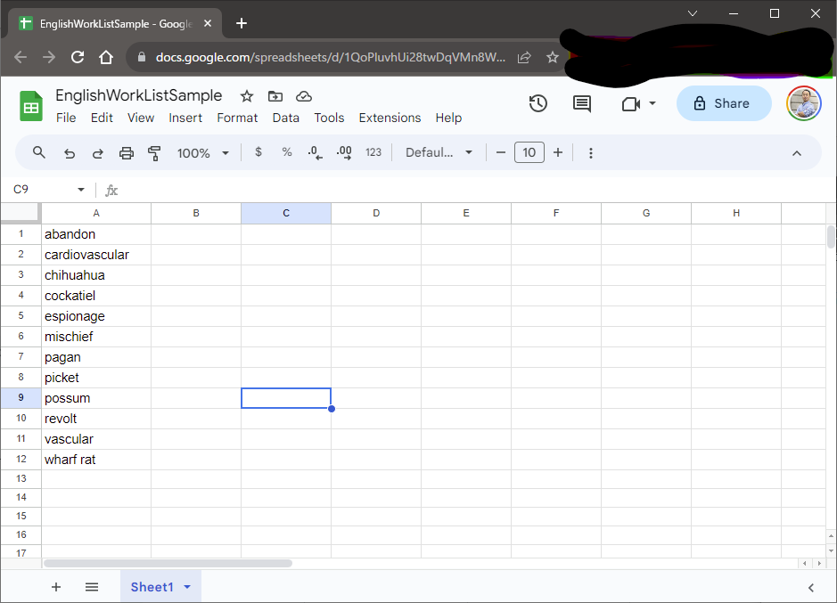
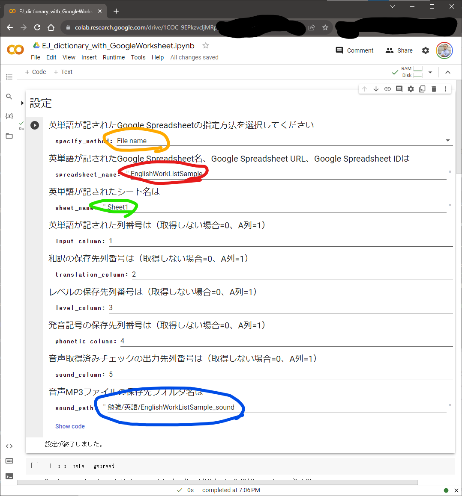
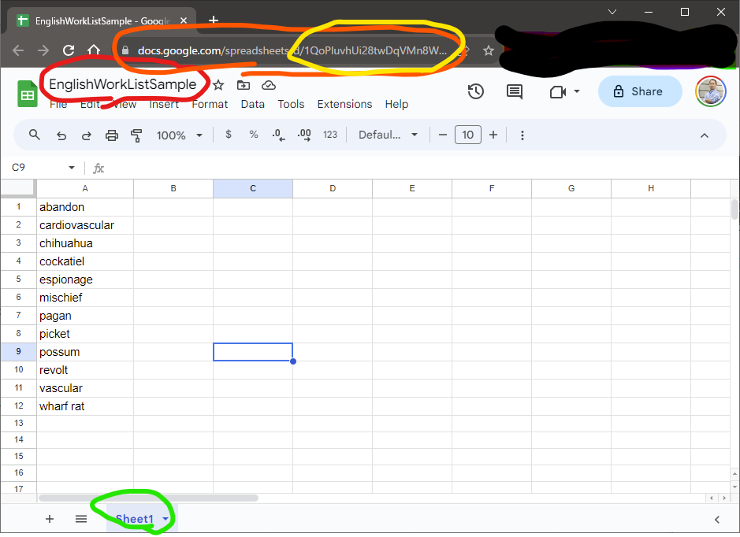
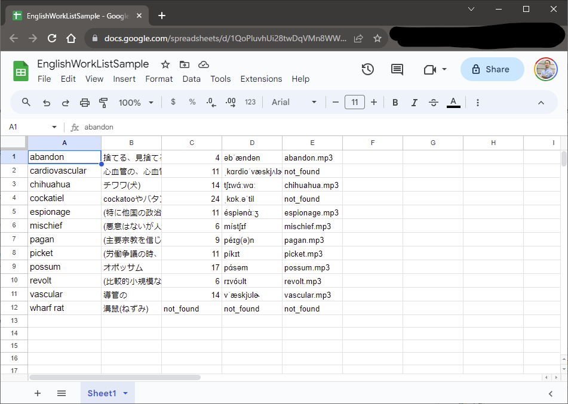
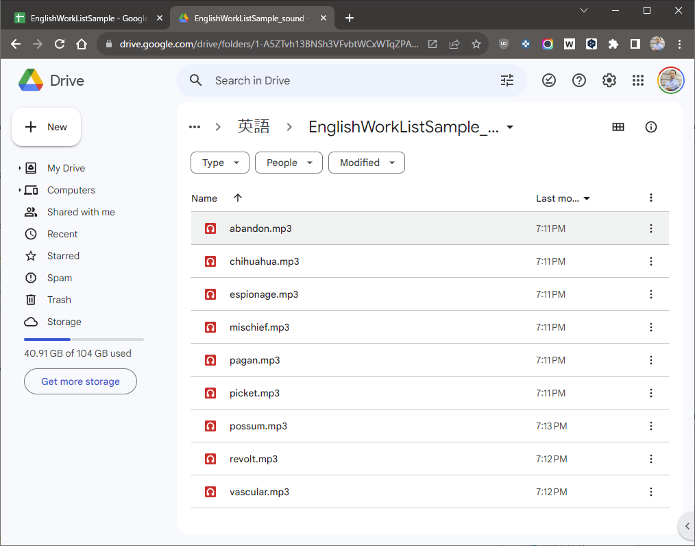

# 英単語の意味をまとめて検索
Google Spreadsheet上の英単語の意味、発音などをWeblio英和辞書で調べます。

## 注意事項

本レポジトリのコード、文章は**コード学習の参考**として示しているものです。
実際に本コードを用いてWeblioからスクレイピングを行うと、Weblioの利用規約に抵触するおそれがあります。
著者は利用者が本コードを用いて行う一切の行為及び、利用者が本コードを利用したために被った損害、損失に対しては一切の責任を負いません。

## 利用環境
- Google Drive
- Google Spreadsheet
- Google Colaboratory

## 対象ユーザ
- 上記の利用環境を使える

## 利用手順

### 調べたい英単語のリストを用意する

下図のように、調べたい英単語を縦1列に整理します  

### プログラムをColaboratoryで開く

### 英単語リストと取得内容を指定する
Colabratoryの画面は以下です

上記画面に必要な設定を入力します
- オレンジ枠部：Google Spreadsheetの指定方法（下に追加説明あり）
  - File name：Google Spreadsheetのファイル名で指定（フォルダパスは不要）
  - URL：Google SpreadsheetのURLで指定
  - Spreadsheet ID：Google SpreadsheetのIDで指定
- 赤枠部：Google SpreadsheetのGoogle Spreadsheet名、Google Spreadsheet URL、Google Spreadsheet IDのいずれか
- 緑枠部：Google SpreadsheetのSheet名
- 枠なし部：英単語が記された列番号、和訳・レベル・発音記号を取得する列番号、発音音声ファイルの取得結果を示す列番号をそれぞれ入力
- 青枠部：発音音声ファイルの保存先（Google Drive上のフォルダパス）

### 追加説明
Google Spreadsheet名、Google Spreadsheet URL、Google Spreadsheet IDは下図の各色枠部に対応します
- 赤枠部：File name
- オレンジ枠部：URL (https://docs.google.com/spreadsheets/d/で始まる)
- 黄色枠部：Spreadsheet ID (URLのうち、"/spreadsheets/d/"以降の部分)

### プログラムを実行する

実行すると、Google Driveへのアクセス確認と、Google Spreadsheetへのアクセス確認の2回、認証画面が現れます。  
両方を「許可」すると、Google Drive上への音声ファイルの保存と、Google Spreadsheetへの和訳の入力等が行われます。  
実行終了するとGoogle Spreadsheetは以下のようになります。見つからなかった箇所は"not_found"となります。  

同時に発音の音声ファイルが以下のように保存されます。  

